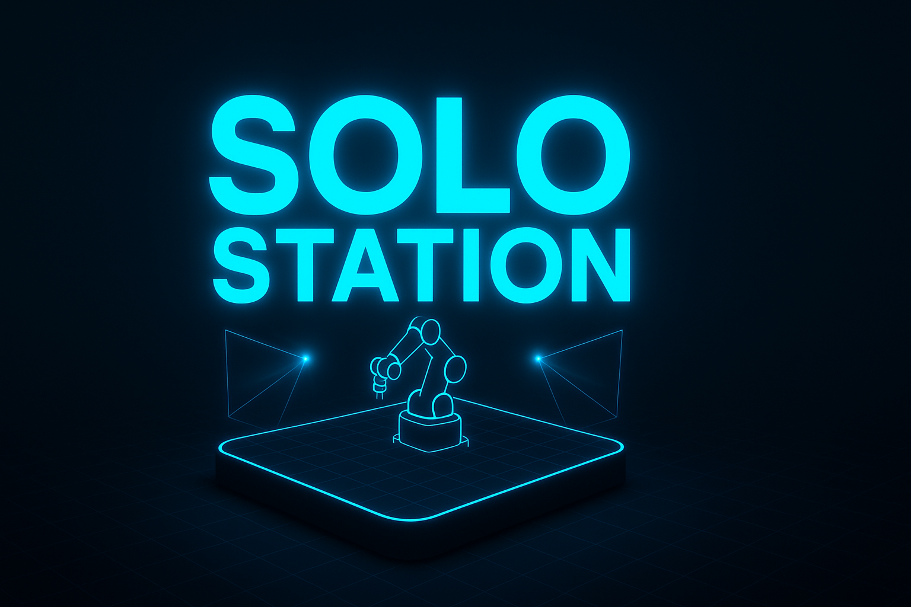

<div align="center">
  

  # Solo Station

  ### A Standardized, 3D-Printed Physical AI Station for Consistent Data Collection and Inference Across Diverse Robotic Platforms

  [](LICENSE)
  []()
  []()

</div>

---

## Overview

Solo Station is a revolutionary approach to robotic AI development that standardizes the physical environment for data collection and inference. By creating a consistent, reproducible 3D-printed station, Solo Station enables:

- **Consistent Data Collection**: Eliminate environmental variables across different robots
- **Platform Agnostic**: Works with diverse robotic systems and configurations
- **Reproducible Results**: Standardized setup ensures reliable, repeatable experiments
- **Easy Deployment**: 3D-printable design for rapid prototyping and scaling

## Key Features

### Standardized Physical Environment
- Precisely engineered 3D-printed components ensure identical setup across locations
- Calibrated sensor mounting positions for consistent data capture
- Modular design for easy customization and maintenance

### Multi-Robot Compatibility
- Universal mounting system supports various robotic platforms
- Flexible sensor integration for different AI models
- Scalable architecture from single robots to fleet deployment

### AI-Optimized Data Collection
- Purpose-built for machine learning workflows
- Consistent environmental conditions for training and inference
- Streamlined data pipeline integration

## Getting Started

### Prerequisites
- 3D printer (recommended: 200mm x 200mm x 200mm build volume or larger)
- Standard PLA or PETG filament
- Basic assembly tools

### Installation

1. Clone the repository:
```bash
git clone https://github.com/yourusername/solo-station.git
cd solo-station
```

2. Print the components using the provided STL files (coming soon)

3. Follow the assembly guide in the documentation

## Use Cases

- **Research**: Standardize experiments across multiple labs and institutions
- **Development**: Consistent environment for training and testing AI models
- **Production**: Deploy reliable inference stations across distributed locations
- **Education**: Reproducible setup for teaching robotics and AI concepts

## Supported Robots

Solo Station supports a wide variety of robot platforms from [robotsthatexist.com](https://robotsthatexist.com) and beyond:

- **Manipulators**: Robot arms and manipulation platforms
- **Mobile Robots**: Wheeled and tracked ground robots
- **Humanoids**: Full-body and upper-torso platforms
- **Hands**: Dexterous manipulation and multi-fingered hands
- **Grippers**: End-effectors and grasping mechanisms
- **Quadrupeds**: Four-legged dynamic platforms

Each robot category includes ready-to-use integration modules with mounting adapters, calibration files, and example code. See the [`modules/`](modules/) directory for details.

## Project Structure

```
solo-station/
├── modules/         # Robot integration modules by category
│   ├── manipulators/
│   ├── mobile/
│   ├── humanoids/
│   ├── hands/
│   ├── grippers/
│   ├── quadrupeds/
│   └── _template/   # Template for creating new modules
├── models/          # 3D printable models (STL files)
├── docs/            # Assembly guides and documentation
├── examples/        # Sample configurations and use cases
└── README.md        # This file
```

## Roadmap

- [ ] Release initial 3D model files
- [ ] Publish assembly documentation
- [ ] Create integration guides for popular robotic platforms
- [ ] Develop sensor calibration tools
- [ ] Build community example gallery

## Contributing

Contributions are welcome! Whether you're improving the design, adding documentation, or sharing your use case, we'd love to hear from you.

1. Fork the repository
2. Create your feature branch (`git checkout -b feature/amazing-feature`)
3. Commit your changes (`git commit -m 'Add amazing feature'`)
4. Push to the branch (`git push origin feature/amazing-feature`)
5. Open a Pull Request

## License

This project is licensed under the MIT License - see the [LICENSE](LICENSE) file for details.

## Contact

For questions, suggestions, or collaborations, please open an issue or reach out through GitHub.

---

<div align="center">
  <strong>Built for the future of standardized robotic AI development</strong>
</div>
